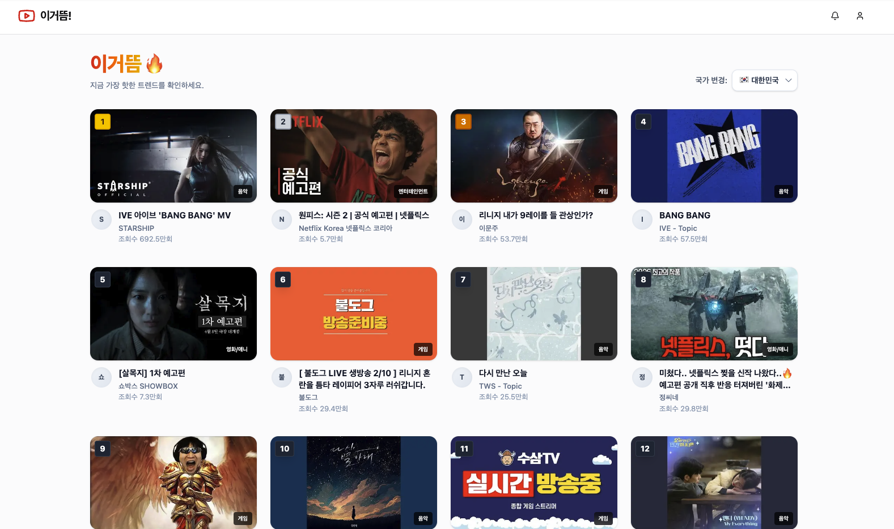

<<<<<<< HEAD
This is a [Next.js](https://nextjs.org) project bootstrapped with [`create-next-app`](https://nextjs.org/docs/app/api-reference/cli/create-next-app).

## Getting Started

First, run the development server:

```bash
npm run dev
# or
yarn dev
# or
pnpm dev
# or
bun dev
```

Open [http://localhost:3000](http://localhost:3000) with your browser to see the result.

You can start editing the page by modifying `app/page.tsx`. The page auto-updates as you edit the file.

This project uses [`next/font`](https://nextjs.org/docs/app/building-your-application/optimizing/fonts) to automatically optimize and load [Geist](https://vercel.com/font), a new font family for Vercel.

## Learn More

To learn more about Next.js, take a look at the following resources:

- [Next.js Documentation](https://nextjs.org/docs) - learn about Next.js features and API.
- [Learn Next.js](https://nextjs.org/learn) - an interactive Next.js tutorial.

You can check out [the Next.js GitHub repository](https://github.com/vercel/next.js) - your feedback and contributions are welcome!

## Deploy on Vercel

The easiest way to deploy your Next.js app is to use the [Vercel Platform](https://vercel.com/new?utm_medium=default-template&filter=next.js&utm_source=create-next-app&utm_campaign=create-next-app-readme) from the creators of Next.js.

Check out our [Next.js deployment documentation](https://nextjs.org/docs/app/building-your-application/deploying) for more details.
=======
# 🔥 이거뜸 (Igeotteum) - YouTube Trending Tracker

> **실시간 유튜브 인기 급상승 동영상을 국가별로 확인하고 분석하는 웹 애플리케이션** > _Developed with Google Gemini_ 🤖✨



## 📖 프로젝트 소개

**이거뜸**은 유튜브의 방대한 데이터 속에서 **지금 당장 뜨고 있는 트렌드**를 한눈에 파악할 수 있도록 돕는 서비스입니다.
복잡한 유튜브 UI에서 벗어나, 순수하게 **순위, 카테고리, 글로벌 트렌드**에 집중할 수 있는 직관적인 인터페이스를 제공합니다.

단순한 클론 코딩을 넘어, **YouTube Data API의 할당량(Quota) 최적화**와 **모바일 퍼스트(Mobile-First) 디자인**을 고려하여 개발되었습니다.

## ✨ 주요 기능

- **🔥 실시간 인기 급상승 차트**: 대한민국 및 주요 국가의 유튜브 트렌드 영상을 1위부터 순서대로 제공합니다.
- **🌍 국가별 트렌드 필터**: 대한민국(KR), 미국(US), 일본(JP) 등 클릭 한 번으로 전 세계 트렌드를 파악할 수 있습니다.
- **🔍 영상 검색 기능**: 유튜브 검색 API를 연동하여 원하는 영상을 즉시 찾아볼 수 있습니다.
- **📱 모바일 최적화 UI**: 모바일 환경을 최우선으로 고려한 레이아웃과 반응형 디자인을 적용했습니다.
- **⚡ 성능 및 비용 최적화**: Next.js의 Caching 전략을 활용하여 API 호출 비용을 최소화했습니다.

## 🛠 기술 스택 (Tech Stack)

| 분류              | 기술                                                            |
| ----------------- | --------------------------------------------------------------- |
| **Framework**     | [Next.js 15 (App Router)](https://nextjs.org/)                  |
| **Language**      | [TypeScript](https://www.typescriptlang.org/)                   |
| **Styling**       | [Tailwind CSS](https://tailwindcss.com/)                        |
| **Data Fetching** | [YouTube Data API v3](https://developers.google.com/youtube/v3) |
| **Deploy**        | [Vercel](https://vercel.com/)                                   |

## 🚀 시작 가이드 (Getting Started)

로컬 환경에서 프로젝트를 실행하려면 다음 단계가 필요합니다.

### 1. 프로젝트 클론

```bash
git clone [https://github.com/your-username/igeotteum.git](https://github.com/your-username/igeotteum.git)
cd igeotteum
```

### 2. 패키지 설치

```bash
npm install
```

### 3. 환경 변수 설정

프로젝트 루트에 .env.local 파일을 생성하고 YouTube Data API 키를 입력하세요.
(Google Cloud Console에서 발급 필요)

```
NEXT_PUBLIC_YOUTUBE_API_KEY=your_api_key_here
```

### 4. 개발 서버 실행

```bash
npm run dev
```

브라우저에서 [http://localhost:3000](http://localhost:3000)으로 접속하여 애플리케이션을 확인하세요.

## 🤖 Collaboration with Gemini

이 프로젝트는 Google Gemini와의 긴밀한 페어 프로그래밍(Pair Programming)을 통해 제작되었습니다.
기획 단계부터 기능 구현, 디버깅, 최적화까지 AI와 협업하며 다음과 같은 기술적 과제들을 해결했습니다.

### 1. API Quota 최적화 (Cost Optimization)

- 문제: YouTube API의 일일 할당량(10,000 units) 제한. 검색(Search) 1회당 100 cost 소모.

- 해결:
  - Next.js의 fetch 옵션에 revalidate: 3600을 적용하여 데이터 캐싱 (1시간).
  - 상세 페이지 진입 대신 target="\_blank"를 사용하여 외부 링크로 유도, 불필요한 API 호출 차단.
  - 개발 환경(NODE_ENV === 'development')에서는 Mock Data를 사용하도록 로직 분리.

### 2. 타입 안정성 확보 (Type Safety)

- 문제: Search API와 Videos API의 응답 구조 차이(id가 객체이거나 문자열인 경우)로 인한 런타임 에러.

- 해결: YoutubeVideo와 YoutubeSearchItem 인터페이스를 명확히 정의하고, 데이터 매핑(Mapping) 단계에서 이를 통일하여 컴포넌트 간 재사용성을 높였습니다.

### 3. 모바일 퍼스트 디자인 (UX/UI)

- 문제: 데스크톱 중심의 레이아웃이 모바일에서 깨지는 현상.

- 해결: flex-col 기반의 모바일 레이아웃을 기본으로 잡고, md:, lg: 브레이크포인트를 확장하는 방식(Mobile-First)으로 CSS를 전면 리팩토링했습니다.

## 📂 폴더 구조 (Project Structure)

```
src/
├── app/
│ ├── page.tsx # 메인 페이지 (트렌드 리스트)
│ ├── search/ # 검색 결과 페이지
│ └── video/[id]/ # 상세 페이지 (현재는 외부 링크로 대체)
├── components/
│ ├── common/ # 공통 UI (VideoCard, SearchBar, CountryFilter)
│ ├── layout/ # 레이아웃 (Header)
│ └── video/ # 비디오 전용 컴포넌트
├── lib/
│ ├── youtube.ts # API 호출 함수 모음 (Fetching Logic)
│ └── constants.ts # 상수 관리 (국가 코드, 카테고리 매핑)
└── types/ # TypeScript 타입 정의
```

## 📄 라이선스 (License)

This project is licensed under the MIT License.
>>>>>>> 9d1263f8101512ddd88b96d4d6bfa0580865fd35
